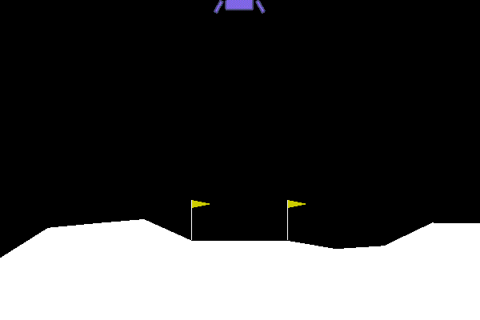

# A small step into Stable Baselines 3


Having a little fun with Stable Baselines 3 and the Lunar Lander from Open AI Gym.

# How to install Stable Baselines 3 with CUDA and Tensorboard

```bash
sudo apt install nvidia-cuda-toolkit <br>
sudo apt install python3-pip <br>
sudo apt install python3-opencv <br>
sudo apt install swig <br>

python3 -m pip install gym <br>
python3 -m pip install gym[all] <br>
python3 -m pip install torch torchvision torchaudio <br>
python3 -m pip install stable-baselines3[extra] <br>

python3 -m pip install tensorflow tensorboard <br>
```

# ON ERROR
If 'libnvinfer.so.7' is missing, do the steps below

# Install tensorrt
```bash
python3 -m pip install tensorrt

## Copy
```bash
cp ~/.local/lib/python3.10/site-packages/tensorrt/libnvinfer.so.8 ~/.local/lib/python3.10/site-packages/tensorrt/libnvinfer.so.7
cp ~/.local/lib/python3.10/site-packages/tensorrt/libnvinfer_plugin.so.8 ~/.local/lib/python3.10/site-packages/tensorrt/libnvinfer_plugin.so.7
```

## OR Symlinc
```bash
ln -s ~/.local/lib/python3.10/site-packages/tensorrt/libnvinfer.so.8 ~/.local/lib/python3.10/site-packages/tensorrt/libnvinfer.so.7
ln -s ~/.local/lib/python3.10/site-packages/tensorrt/libnvinfer_plugin.so.8 ~/.local/lib/python3.10/site-packages/tensorrt/libnvinfer_plugin.so.7

```
## add to bashrc
```bash
export LD_LIBRARY_PATH=$LD_LIBRARY_PATH:/home/k3nny/.local/lib/
export LD_LIBRARY_PATH=$LD_LIBRARY_PATH:/home/k3nny/.local/lib/python3.10/site-packages/tensorrt/
